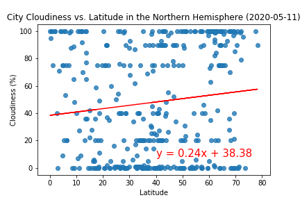
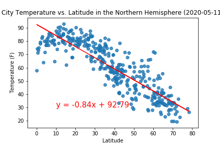
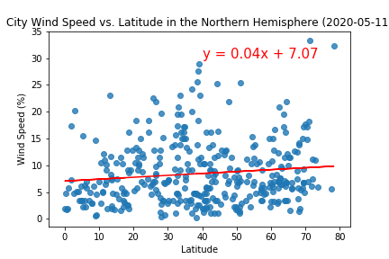

# Weather Analysis 

Using Openweather API, I gathered data of over 500 cities and find out which is the best place to take a vacation in. The data analyzed for each hemisphere was

* Cloudiness
* Humidity
* Temperature
* Wind speed

Using this data and plots I showed these cities in a map with the nearest hotels.

## Built with
* Python 
* Pandas
* Matplotlib

